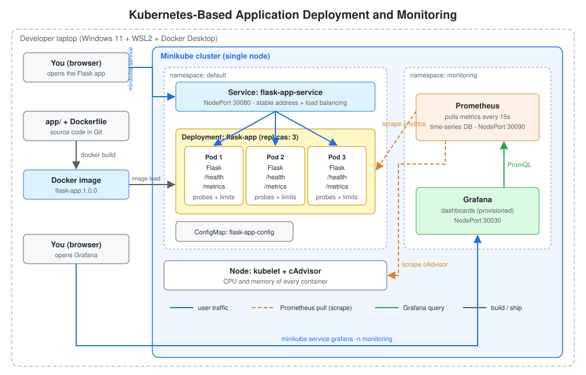

# Phase-by-Phase Build Guide

This guide rebuilds the project from scratch, one phase at a time. Every command is explained in the same format:

- **What** - what the command does
- **Why** - why the project needs it
- **Where** - which terminal and folder to run it in
- **Expected** - what a successful result looks like
- **If it fails** - the common errors and how to fix them

Terminals used in this guide:

| Name | How to open it | Used for |
|---|---|---|
| PowerShell | Start menu, type "PowerShell" | Installing tools on Windows |
| Git Bash | Right-click in the project folder, "Open Git Bash here" | Every `docker`, `minikube`, `kubectl` and script command |

All commands except the Phase 1 installs are run from the project root folder (`k8s-flask-monitoring/`). The same commands work on Linux and macOS.

## Phase 1 - Architecture and Prerequisites

### The big picture



1. You write a small **Flask** app and package it into a **Docker image**.
2. The image is loaded into **Minikube**, a one-node Kubernetes cluster that runs inside Docker on your laptop.
3. A **Deployment** keeps 3 copies (pods) of the app running. A **Service** gives them one stable address and spreads traffic across them.
4. **Prometheus** pulls (scrapes) metrics every 15 seconds: CPU and memory from **cAdvisor** (part of the kubelet), and request counts from the app's `/metrics` endpoint.
5. **Grafana** queries Prometheus and draws the dashboard.

### Why each tool is here

| Tool | Problem it solves |
|---|---|
| Docker | "It works on my machine": the image carries Python, the libraries and the code together |
| Kubernetes | Running many containers reliably: restarts, scaling, load balancing, rolling updates |
| Minikube | Real Kubernetes on a laptop without paying for a cloud cluster |
| Prometheus | Collects and stores numbers over time (time-series database) |
| Grafana | Turns those numbers into graphs humans can read |

### How DRY (Don't Repeat Yourself) is applied

| Fact | Single source of truth | Who reuses it |
|---|---|---|
| App port, name, version | `app/config.py` (env vars with defaults) | Flask, gunicorn |
| Image tag / version | `image:` line in `k8s/deployment.yaml` | `scripts/deploy.sh` reads it and passes it to `docker build` |
| Port number 5000 | `containerPort` named `http` | Probes, Service `targetPort`, Prometheus scrape config all say `http` |
| Health check | YAML anchor `&health-check` | Readiness and liveness probes |
| Pod label `app: flask-app` | Deployment template | Service selector, tests |
| Dashboard | `monitoring/dashboards/flask-app.json` | Turned into a ConfigMap by the deploy script, never copied |
| Explanations | `docs/*.md` | README links to them, the PDF is generated from them |

### Prerequisites

| Tool | Check command | Install (Windows) |
|---|---|---|
| WSL2 | `wsl --status` | `wsl --install` (admin PowerShell, then reboot) |
| Docker Desktop | `docker version` | `winget install -e --id Docker.DockerDesktop` |
| Minikube | `minikube version` | `winget install -e --id Kubernetes.minikube` |
| kubectl | `kubectl version --client` | `winget install -e --id Kubernetes.kubectl` |
| Git + Git Bash | `git --version` | `winget install -e --id Git.Git` |
| Python 3.10+ | `python --version` | `winget install -e --id Python.Python.3.12` |

Hardware: at least 8 GB RAM (16 GB is comfortable) and virtualization enabled in the BIOS.

### Install WSL2

```powershell
wsl --install
```

- **What:** Installs the Windows Subsystem for Linux (version 2) and Ubuntu.
- **Why:** Containers are a Linux kernel feature (namespaces and cgroups). Docker Desktop runs its engine inside WSL2.
- **Where:** PowerShell opened with "Run as administrator".
- **Expected:** `The requested operation is successful. Changes will not be effective until the system is rebooted.` Reboot, then create a Linux username and password when Ubuntu opens.
- **If it fails:** `0x80370102` means virtualization is disabled. Enable Intel VT-x or AMD-V/SVM in the BIOS (Task Manager > Performance > CPU shows "Virtualization: Enabled" when it is on). "Requires elevation" means PowerShell was not opened as administrator. If the install hangs at 0%, use `wsl --install --web-download`.

### Install and verify Docker Desktop

```powershell
winget install -e --id Docker.DockerDesktop
```

- **What:** Installs Docker Desktop using the Windows package manager (`-e` = exact id match).
- **Why:** Docker builds the image, and Minikube uses Docker as its driver (the whole Kubernetes node is one Docker container).
- **Where:** PowerShell. Afterwards start Docker Desktop, accept the terms, and wait for "Engine running".
- **Expected:** `Successfully installed`.
- **If it fails:** If `winget` is not recognised, download the installer from docker.com.

```bash
docker run hello-world
```

- **What:** Downloads a tiny test image and runs it.
- **Why:** Proves the Docker client can talk to the Docker engine and pull images.
- **Where:** A new Git Bash window (new windows pick up the updated PATH).
- **Expected:** `Hello from Docker! This message shows that your installation appears to be working correctly.`
- **If it fails:** `error during connect ... dockerDesktopLinuxEngine` means Docker Desktop is not running. Start it and wait for the green "Engine running" status.

### Create the repository with YOUR identity

```bash
mkdir -p ~/projects/k8s-flask-monitoring && cd ~/projects/k8s-flask-monitoring
git init -b main
git config user.name "Your Name"
git config user.email "you@example.com"
```

- **What:** Creates the folder, turns it into a Git repository, and sets the author for commits in this repository only.
- **Why:** On a shared laptop the global identity may belong to someone else. GitHub credits commits by email, so your email must be the one on your GitHub account.
- **Where:** Git Bash.
- **Expected:** `Initialized empty Git repository in .../k8s-flask-monitoring/.git/`
- **If it fails:** If commits later show the wrong person on GitHub, check `git log --format='%an <%ae>'` and make sure that email is verified on your GitHub account.

## Phase 2 - The Flask Application

### Files

| File | Purpose |
|---|---|
| `app/config.py` | All settings in one place, read from environment variables with defaults |
| `app/app.py` | The routes and the Prometheus metrics |
| `app/gunicorn.conf.py` | Production web server settings (port comes from `config.py`) |
| `app/requirements.txt` | Pinned runtime dependencies |
| `tests/test_app.py` | Unit tests for the endpoints |

### Endpoints

| Endpoint | Used by | Why it exists |
|---|---|---|
| `GET /` | People | Homepage. Shows which pod answered, so you can see load balancing |
| `GET /health` | Kubernetes probes | Returns 200 when healthy, 503 after `/fail` |
| `GET /metrics` | Prometheus | Request counters and latency histograms in Prometheus text format |
| `GET /work?ms=100` | Load tests | Burns CPU for a few milliseconds so the graphs move |
| `POST /fail` | Phase 9 demos | Makes `/health` fail, to watch probes in action |

### Key ideas in the code

- **Configuration from the environment (12-factor app):** The same image runs everywhere. Kubernetes changes behaviour by setting env vars (from the ConfigMap), not by rebuilding.
- **Metrics with labels:** `flask_http_requests_total{method, endpoint, status}` is a counter. The `endpoint` label uses the route pattern (`/work`), never the raw URL. Otherwise every different URL would create a new time series and could overload Prometheus ("high cardinality").
- **Counter vs Histogram:** A counter only goes up (total requests). A histogram puts durations into buckets so Prometheus can calculate percentiles such as p95 latency.
- **One gunicorn worker per container:** Kubernetes scales by adding pods, not processes. It also keeps the metrics in one process.

### Run the tests

```bash
python -m venv .venv
source .venv/Scripts/activate        # Linux/macOS: source .venv/bin/activate
pip install -r requirements-dev.txt
python -m pytest
```

- **What:** Creates an isolated Python environment, installs Flask and the test tools into it, then runs every test in `tests/`.
- **Why:** A virtual environment keeps project libraries separate from system Python. Tests prove the app works before it goes anywhere near Docker.
- **Where:** Git Bash, project root.
- **Expected:** `10 passed`.
- **If it fails:** `ModuleNotFoundError: flask` means the venv is not active (the prompt should start with `(.venv)`). If `python` is not recognised, reinstall Python with "Add to PATH" ticked.

### Run the app locally

```bash
python app/app.py
```

- **What:** Starts Flask's development server on port 5000.
- **Why:** The quickest feedback loop while writing code. (Gunicorn is used in the container. It does not run on Windows, and it does not need to here.)
- **Where:** Git Bash, project root, venv active. Leave it running and use a second terminal or a browser.
- **Expected:** `Running on http://127.0.0.1:5000`. Open http://localhost:5000 and http://localhost:5000/health.
- **If it fails:** `Address already in use` means another program uses port 5000. Run `PORT=5050 python app/app.py` (the port comes from `config.py`).

```bash
curl localhost:5000/health
curl localhost:5000/metrics | grep flask_http
```

- **Expected:** `{"pod": "localhost", "status": "ok"}`, then lines such as `flask_http_requests_total{endpoint="/health",method="GET",status="200"} 1.0`.

Stop the server with `Ctrl+C`.

## Phase 3 - Dockerize the Application

### The Dockerfile, line by line

| Instruction | Meaning |
|---|---|
| `FROM python:3.12-slim` | Start from the official Python image, Debian "slim" (small) variant |
| `ARG APP_VERSION=dev` | A build-time variable; the deploy script passes the real version |
| `ENV PYTHONUNBUFFERED=1 ...` | Print logs immediately so `kubectl logs` shows them in real time |
| `WORKDIR /app` | All following commands run in `/app` inside the image |
| `COPY app/requirements.txt .` then `RUN pip install` | Copy only the dependency list first so this slow layer is cached until requirements change |
| `COPY app/ .` | Copy the source code (changes often, so it comes last) |
| `RUN useradd ...` / `USER 10001` | Run as a normal user, not root, to limit damage if the app is compromised |
| `EXPOSE 5000` | Documentation of the port; it does not publish anything |
| `CMD ["gunicorn", ...]` | The process the container runs |

**Layer caching:** each instruction creates a layer. Docker reuses a layer if nothing it depends on has changed. Putting rarely-changing steps first makes rebuilds take seconds.

`.dockerignore` keeps `.git`, `.venv`, tests and docs out of the build context, so the build is faster and the image smaller.

### Build the image

```bash
docker build -t flask-app:1.0.0 .
```

- **What:** Reads the `Dockerfile` in the current folder (`.` is the build context) and creates an image tagged `flask-app:1.0.0`.
- **Why:** The image is the unit Kubernetes runs.
- **Where:** Git Bash, project root, Docker Desktop running.
- **Expected:** Several `[n/7]` steps ending with `naming to docker.io/library/flask-app:1.0.0`.
- **If it fails:** `failed to read dockerfile` means you are not in the project root. `Cannot connect to the Docker daemon` means Docker Desktop is not running. Network errors during `pip install` are usually a proxy or VPN.

```bash
docker images flask-app
```

- **Expected:** One row `flask-app 1.0.0 <id> ... ~150MB`.

### Run the container

```bash
docker run -d --name flask-test -p 5000:5000 flask-app:1.0.0
curl localhost:5000/health
docker logs flask-test
docker rm -f flask-test
```

- **What:** `-d` runs in the background, `--name` gives it a name, `-p 5000:5000` maps laptop port 5000 to container port 5000. Then we check health, read the logs and remove the container.
- **Why:** Prove the image works on its own before adding Kubernetes. If it fails here, it will fail in Kubernetes too.
- **Where:** Git Bash.
- **Expected:** `curl` returns `"status": "ok"` with a container id as `pod`. `docker logs` shows `Listening at: http://0.0.0.0:5000` and the request line.
- **If it fails:** `port is already allocated` means something else uses 5000; use `-p 5050:5000`. If the container exits at once, `docker logs flask-test` shows the Python error.

## Phase 4 - Minikube and the Kubernetes Environment

### Start the cluster

```bash
minikube start --driver=docker --cpus=2 --memory=4096
```

- **What:** Creates a single-node Kubernetes cluster inside a Docker container with 2 CPUs and 4 GB RAM, and points `kubectl` at it.
- **Why:** Gives us a real Kubernetes API server, scheduler and kubelet to deploy to.
- **Where:** Git Bash, Docker Desktop running. The first run downloads about 1 GB.
- **Expected:** Ends with `Done! kubectl is now configured to use "minikube" cluster and "default" namespace by default`.
- **If it fails:** `PROVIDER_DOCKER_NOT_RUNNING` means you should start Docker Desktop. If the error says Docker has less memory than requested, use `--memory=3072` or give Docker more memory in Settings > Resources. If an old broken cluster exists, run `minikube delete` and start again.

```bash
minikube status
kubectl get nodes
```

- **What:** Shows the state of the cluster components, then lists the cluster's nodes.
- **Expected:** `host: Running`, `kubelet: Running`, `apiserver: Running`, then one node `minikube   Ready   control-plane`.
- **If it fails:** `The connection to the server ... was refused` means the cluster is stopped (`minikube start`) or `kubectl` points elsewhere. Check with `kubectl config current-context`; it should print `minikube`.

### Enable metrics-server

```bash
minikube addons enable metrics-server
```

- **What:** Installs the component that powers `kubectl top`.
- **Why:** A quick CPU and memory check from the terminal while troubleshooting. Prometheus is for history; `kubectl top` is for "right now".
- **Expected:** `The 'metrics-server' addon is enabled`. After about a minute, `kubectl top nodes` shows numbers.

### Make the image available inside Minikube

```bash
minikube image load flask-app:1.0.0
minikube image ls | grep flask-app
```

- **What:** Copies the image from your Docker into Minikube's own container runtime.
- **Why:** Minikube has a separate image store. Without this, Kubernetes would try to download `flask-app:1.0.0` from Docker Hub and fail.
- **Expected:** `docker.io/library/flask-app:1.0.0`.
- **If it fails:** If it is not listed, rebuild the image (Phase 3) and load it again. Every time you rebuild, load again or change the tag.

## Phase 5 - Deployment and Service YAML

### Anatomy of every Kubernetes YAML file

| Field | Meaning |
|---|---|
| `apiVersion` | Which API group and version defines this kind (`v1`, `apps/v1`) |
| `kind` | The type of object: Deployment, Service, ConfigMap... |
| `metadata` | Name, namespace and labels |
| `spec` | The desired state: what you want Kubernetes to make true |

Kubernetes is **declarative**: you describe the desired state, and controllers keep working until the actual state matches it.

### Pod vs Deployment vs Service

| Object | What it is | Analogy |
|---|---|---|
| Pod | One or more containers sharing a network IP; temporary | One worker |
| ReplicaSet | Keeps exactly N pods matching a label | A supervisor who counts workers |
| Deployment | Manages ReplicaSets: rolling updates, rollback | The manager who hires and swaps supervisors |
| Service | Stable virtual IP and DNS name that load-balances across ready pods with a label | The reception desk phone number |

### The three files

- `k8s/configmap.yaml` - environment variables (`APP_ENV`) kept outside the image.
- `k8s/deployment.yaml` - 3 replicas of `flask-app:1.0.0`. `selector.matchLabels` must match `template.metadata.labels`; this is how the Deployment knows which pods it owns. `imagePullPolicy: IfNotPresent` uses the image we loaded. The port is **named** `http`.
- `k8s/service.yaml` - a `NodePort` Service. `selector: app: flask-app` picks the pods, `port: 80` is the in-cluster port, `targetPort: http` is the container port, and `nodePort: 30080` is opened on the node.

Service types: `ClusterIP` (inside the cluster only, the default), `NodePort` (also on every node's IP at a port from 30000-32767), and `LoadBalancer` (cloud load balancer). NodePort is the simplest choice that is reachable from outside on Minikube.

### Deploy

```bash
kubectl apply -f k8s/
```

- **What:** Sends every YAML file in `k8s/` to the API server. `apply` creates objects or updates them to match the file.
- **Why:** This is the declarative workflow: the files in Git are the source of truth.
- **Where:** Git Bash, project root.
- **Expected:** `configmap/flask-app-config created`, `deployment.apps/flask-app created`, `service/flask-app-service created`. Running it again prints `unchanged`.
- **If it fails:** `error validating data` means a YAML indentation or field-name typo; the message names the line.

```bash
kubectl get pods -l app=flask-app -o wide
```

- **What:** Lists pods with the label `app=flask-app`, with their IP and node (`-o wide`).
- **Expected:** After 10-20 seconds, three pods `flask-app-<hash>-<id>` with `READY 1/1` and `STATUS Running`.
- **If it fails:** See the status table below, and the Troubleshooting chapter.

| Status | Meaning | Fix |
|---|---|---|
| `ErrImagePull` / `ImagePullBackOff` | Image not found in Minikube | `minikube image load flask-app:1.0.0`; check the tag matches the YAML |
| `CreateContainerConfigError` | Referenced ConfigMap or Secret missing | `kubectl apply -f k8s/configmap.yaml` |
| `CrashLoopBackOff` | Container starts and exits repeatedly | `kubectl logs <pod> --previous` |
| `Pending` | No node has enough free CPU or memory for the requests | `kubectl describe pod <pod>`, lower requests or give Minikube more resources |
| `Running` but `0/1` | Readiness probe failing | `kubectl describe pod <pod>`, look at the Events |

```bash
kubectl get deployment,replicaset,service,endpoints
```

- **What:** Shows the Deployment, the ReplicaSet it created, the Service, and the Service's endpoints (the pod IPs it currently sends traffic to).
- **Expected:** Deployment `3/3`, Service `NodePort 80:30080/TCP`, endpoints listing three `IP:5000` addresses.
- **If it fails:** Empty endpoints (`<none>`) means the Service selector matches no ready pods. Compare the labels with `kubectl get pods --show-labels`.

### Open the app

```bash
minikube service flask-app-service --url
```

- **What:** Opens a tunnel from your laptop to the NodePort and prints the URL.
- **Why:** With the Docker driver on Windows and macOS, the Minikube node IP is not directly reachable, so a tunnel is needed.
- **Where:** Git Bash. **Keep this terminal open**; closing it closes the tunnel.
- **Expected:** `http://127.0.0.1:<random-port>`. Open it in the browser.
- **If it fails:** If the page does not load, check the endpoints (above) and that the pods are `1/1`.

```bash
for i in $(seq 1 6); do curl -s <URL>/health; echo; done
```

- **What:** Calls the Service six times.
- **Expected:** The `pod` field changes between the three pod names: that is the Service load balancing. (A browser reuses one connection, so it often keeps hitting the same pod.)

## Phase 6 - Replicas, Probes and Resource Limits

### Replicas

The Deployment creates a **ReplicaSet**, whose controller constantly compares "desired = 3" with "actual = number of running pods with the label" and creates or deletes pods to close the gap. This loop is called **reconciliation** and it is the heart of Kubernetes.

```bash
kubectl scale deployment flask-app --replicas=5
kubectl get pods -l app=flask-app
```

- **What:** Changes the desired replica count to 5.
- **Expected:** Two new pods appear. Run `kubectl scale ... --replicas=3` to go back; two pods move to `Terminating`.
- **Note:** `kubectl scale` changes the live object only. The YAML in Git still says 3, and the next `kubectl apply` resets it. The YAML file is the source of truth.

### Readiness vs liveness probes

| | Readiness probe | Liveness probe |
|---|---|---|
| Question | Can this pod receive traffic right now? | Is this container stuck or broken? |
| On failure | Pod is removed from the Service endpoints (no restart) | kubelet kills and restarts the container |
| Typical use | Startup warm-up, temporary overload, dependency down | Deadlock, hung process |
| Our settings | every 5s, 3 failures = not ready (about 15s) | starts after 10s, every 10s, 3 failures = restart (about 30s) |

Both use the same `httpGet` check, defined once with a YAML anchor (`&health-check`) and reused (`*health-check`). Liveness is deliberately slower and more tolerant than readiness, because a restart is more disruptive than a short removal from traffic.

There is also a `startupProbe` for slow-starting apps. It is not needed here because Flask starts in under a second.

### Requests vs limits

| | Requests | Limits |
|---|---|---|
| Meaning | Guaranteed minimum; used by the scheduler to place the pod | Hard maximum enforced at runtime |
| CPU above it | - | Throttled (slowed down), never killed |
| Memory above it | - | Container is killed: `OOMKilled` |
| Ours | 100m CPU, 64Mi | 250m CPU, 128Mi |

`100m` = 100 millicores = 0.1 CPU core. `Mi` = mebibytes. Because requests are lower than limits, the pods are in the **Burstable** QoS class (requests = limits would be **Guaranteed**).

```bash
kubectl top pods -l app=flask-app
kubectl describe pod -l app=flask-app | grep -A3 -E "Limits|Requests|Liveness|Readiness|QoS"
```

- **What:** Shows current usage, then the configured resources, probes and QoS class.
- **Expected:** Each pod uses about 1m CPU and 30-40Mi memory while idle. `QoS Class: Burstable`.
- **If it fails:** `Metrics API not available` means metrics-server is still starting. Wait a minute.

### Rolling updates and rollback

```bash
kubectl rollout restart deployment/flask-app
kubectl rollout status deployment/flask-app
kubectl rollout history deployment/flask-app
```

- **What:** Replaces the pods one at a time, waits for the rollout to finish, then lists the revisions.
- **Why:** With `maxUnavailable: 0` and `maxSurge: 1`, Kubernetes starts a new pod, waits until its readiness probe passes, and only then removes an old one. Users see no downtime.
- **Expected:** `deployment "flask-app" successfully rolled out`.
- `kubectl rollout undo deployment/flask-app` returns to the previous revision.

## Phase 7 - Prometheus and Grafana

### How Prometheus collects metrics

- **Pull model:** Prometheus calls HTTP endpoints (targets) on a schedule (`scrape_interval: 15s`) and stores each value with a timestamp. Applications do not push anything.
- **Exposition format:** A target returns plain text such as `flask_http_requests_total{endpoint="/health",method="GET",status="200"} 42`.
- **Time series:** Metric name + set of labels = one series. `sum by (pod)` and similar operations group series by their labels.
- **Service discovery:** Instead of a fixed list of IPs, Prometheus asks the Kubernetes API for all pods and nodes (`kubernetes_sd_configs`). Relabeling rules filter and rename them. New replicas are found automatically.
- **RBAC:** Asking the API server for pods and nodes needs permission, which is what the ServiceAccount, ClusterRole and ClusterRoleBinding grant (read-only).

Our three scrape jobs, in `monitoring/10-prometheus.yaml`:

| Job | Target | Gives us |
|---|---|---|
| `prometheus` | Prometheus itself | Proves scraping works |
| `kubernetes-cadvisor` | kubelet's built-in cAdvisor, via the API server proxy | `container_cpu_usage_seconds_total`, `container_memory_working_set_bytes` for every container |
| `app-pods` | Every pod annotated `prometheus.io/scrape: "true"`, on its port named `http` | Request counts and latency from `/metrics` |

### Why plain YAML and not Helm

Helm (and the kube-prometheus-stack chart) installs dozens of objects you would not be able to explain yet. Our version has one Deployment, one Service and one ConfigMap per tool, plus RBAC, and every line is commented. Helm is the natural next step once these basics are clear.

### Install

```bash
kubectl apply -f monitoring/
kubectl create configmap grafana-dashboards -n monitoring \
  --from-file=monitoring/dashboards/ --dry-run=client -o yaml | kubectl apply -f -
```

- **What:** Creates the `monitoring` namespace, Prometheus (RBAC, config, Deployment, Service) and Grafana. The second command turns the dashboard JSON file into a ConfigMap. `--dry-run=client -o yaml | kubectl apply -f -` means "generate the YAML, then apply it", so re-running updates it instead of failing with "already exists".
- **Why:** The files are numbered (`00-`, `10-`, `20-`) because `kubectl apply -f <folder>` processes them alphabetically, and the namespace must exist first.
- **Where:** Git Bash, project root.
- **Expected:** `namespace/monitoring created`, `clusterrole.../prometheus created`, ... `configmap/grafana-dashboards created`.
- **If it fails:** `namespaces "monitoring" not found` means the files were applied out of order; run the command again. A Grafana pod stuck in `ContainerCreating` with a `FailedMount` event means the `grafana-dashboards` ConfigMap is missing; run the second command.

```bash
kubectl get pods -n monitoring
```

- **Expected:** `prometheus-...` and `grafana-...` both `1/1 Running` within about a minute (the images are downloaded the first time).

### Check the targets

```bash
minikube service prometheus -n monitoring --url
```

Open the URL, then **Status > Targets**.

- **Expected:** `prometheus (1/1 up)`, `kubernetes-cadvisor (1/1 up)`, `app-pods (3/3 up)`.
- **If it fails:** If `kubernetes-cadvisor` shows `403 Forbidden`, the ClusterRole is missing `nodes/proxy` or the binding names the wrong ServiceAccount. If `app-pods` shows 0 targets, check that the pod template has the annotation and that the port is named `http`.

### PromQL starter pack

Try these on the Prometheus **Graph** page:

| Query | Meaning |
|---|---|
| `up` | 1 = target scraped OK, 0 = down |
| `flask_http_requests_total` | Raw counters (always increasing) |
| `rate(flask_http_requests_total[1m])` | Per-second increase over the last minute |
| `sum by (pod) (rate(flask_http_requests_total[1m]))` | Requests per second per pod |
| `rate(container_cpu_usage_seconds_total{container="flask-app"}[1m])` | CPU cores used per container |
| `container_memory_working_set_bytes{container="flask-app"}` | Memory per container (what the OOM killer looks at) |

**Rule:** use `rate()` on counters (names ending in `_total` or `_seconds_total`); use gauges (memory) directly.

## Phase 8 - The Grafana Dashboard

### Open Grafana

```bash
minikube service grafana -n monitoring --url
```

- **Where:** A separate Git Bash window; keep it open.
- **Expected:** A URL. Log in with `admin` / `admin`; Grafana then asks you to choose a new password.
- **If it fails:** If the page does not load, check `kubectl get pods -n monitoring`. A Grafana pod that is `0/1` is still starting.

Go to **Dashboards > Flask App on Kubernetes**. The data source and dashboard were **provisioned**: Grafana read them from the files mounted by the ConfigMaps at startup, so nothing has to be clicked by hand, and a reinstall brings them back.

### What each panel shows

| Panel | PromQL | Source |
|---|---|---|
| Healthy pods being scraped | `sum(up{job="app-pods"})` | Prometheus |
| Total requests / second | `sum(rate(flask_http_requests_total[...]))` | App `/metrics` |
| CPU usage per pod | `sum by (pod) (rate(container_cpu_usage_seconds_total{container="flask-app"}[...]))` | cAdvisor |
| Memory usage per pod | `sum by (pod) (container_memory_working_set_bytes{container="flask-app"})` | cAdvisor |
| Requests per second by pod | `sum by (pod) (rate(flask_http_requests_total[...]))` | App `/metrics` |
| 95th percentile response time | `histogram_quantile(0.95, sum by (le, endpoint) (rate(..._bucket[...])))` | App `/metrics` |

`$__rate_interval` is a Grafana variable that chooses a safe `rate()` window based on the scrape interval and zoom level.

### Build one panel yourself (practice)

1. **Dashboards > New > New dashboard > Add visualization**, and choose **Prometheus**.
2. Query: `sum by (pod) (container_memory_working_set_bytes{container="flask-app"})`.
3. Legend: `{{pod}}`. Unit (right panel, Standard options): **bytes (IEC)**.
4. **Apply**, then save. **Share > Export > Save to file** exports the JSON. This is how `flask-app.json` was made.

### Generate traffic

```bash
./scripts/load.sh 50
```

- **What:** Starts a temporary `busybox` pod inside the cluster that calls `http://flask-app-service/work?ms=50` in a loop. An optional second argument sets the number of parallel clients.
- **Why:** Idle graphs are flat. Load makes CPU, requests per second and latency move, which makes for good screenshots. Because traffic goes through the Service, the three pods share it.
- **Where:** Git Bash, project root. Stop it with `Ctrl+C` (the pod is deleted automatically because of `--rm`).
- **Expected:** `Sending load with 1 client(s), 50 ms per request.` After 30 seconds the dashboard shows activity.
- **If it fails:** `pods "load-generator" already exists` means a previous run is still there; run `kubectl delete pod load-generator`. `Unable to use a TTY` in Git Bash means winpty is missing; run it from PowerShell instead.

### Screenshots for the README

Save them to `docs/screenshots/` with exactly these names (the README already links them):

- `grafana-dashboard.png` - the whole dashboard under load
- `prometheus-targets.png` - Status > Targets with all jobs up
- `pods-running.png` - terminal showing `kubectl get pods -A`
- `self-healing.png` - terminal during the pod-deletion test (Phase 9)

## Phase 9 - Testing and Troubleshooting

Open the Grafana dashboard and a terminal side by side for these experiments. The general troubleshooting method and the error catalogue are in the **Troubleshooting** chapter.

### Test 1 - Self-healing (pod deletion)

```bash
kubectl get pods -l app=flask-app -w
```

In a second terminal:

```bash
kubectl delete pod <one-flask-app-pod-name>
```

- **What:** `-w` (watch) streams changes. Deleting a pod removes one replica.
- **Expected:** The deleted pod goes `Terminating`, and **immediately** a new pod with a new name appears: `Pending`, then `ContainerCreating`, then `Running 0/1`, then `1/1` once readiness passes. The "Healthy pods" panel briefly drops to 2.
- **Why it happens:** The ReplicaSet saw actual (2) is less than desired (3) and created a pod. Pods are disposable ("cattle, not pets"); the Deployment is what lasts.
- Try `kubectl delete pods -l app=flask-app` (all three at once) and watch all of them come back.

### Test 2 - Liveness probe restarts a broken container

```bash
kubectl port-forward deployment/flask-app 8080:5000
```

In a second terminal:

```bash
curl -X POST localhost:8080/fail
kubectl get pods -l app=flask-app -w
```

- **What:** `port-forward` connects to **one** pod (bypassing the Service). `/fail` makes that pod's `/health` return 503.
- **Expected:** After about 15s the pod shows `0/1` (readiness failed, so it is removed from the Service). After about 30s the `RESTARTS` column goes to 1 (liveness failed, so the container restarted) and the pod becomes `1/1` again, because a fresh process starts healthy.
- `kubectl describe pod <name>` shows Events such as `Readiness probe failed: HTTP probe failed with statuscode: 503` and `Container flask-app failed liveness probe, will be restarted`.
- **Lesson:** Readiness protects users (no traffic to a bad pod); liveness repairs the pod.

### Test 3 - A bad release does not take the site down

```bash
kubectl set image deployment/flask-app flask-app=flask-app:9.9.9
kubectl get pods -l app=flask-app
kubectl rollout status deployment/flask-app --timeout=30s
```

- **What:** Updates the Deployment to an image tag that does not exist.
- **Expected:** One new pod is stuck in `ErrImagePull` / `ImagePullBackOff`, but the **three old pods keep running**: with `maxUnavailable: 0`, Kubernetes never removes an old pod until a new one is ready. `rollout status` times out.
- **Fix:**

```bash
kubectl rollout undo deployment/flask-app
```

- **Expected:** `deployment.apps/flask-app rolled back`. The broken pod disappears.

### Test 4 - Memory limit and OOMKilled

```bash
kubectl set resources deployment flask-app --requests=memory=16Mi --limits=memory=16Mi
kubectl get pods -l app=flask-app -w
```

- **What:** Lowers the memory limit below what Python and gunicorn need. The request is lowered too, because a request may never be larger than its limit.
- **Expected:** New pods go to `OOMKilled`, then `CrashLoopBackOff`. `kubectl describe pod <name>` shows `Last State: Terminated, Reason: OOMKilled, Exit Code: 137` (137 = 128 + signal 9, SIGKILL). Old pods keep serving traffic, as in Test 3.
- **Fix:** `kubectl rollout undo deployment/flask-app`, or `kubectl apply -f k8s/` to return to the version in Git.

### Test 5 - CPU limit and throttling

```bash
./scripts/load.sh 500 6
```

- **What:** 6 parallel clients, each asking for 500 ms of CPU work per request, which is far more than 3 pods x 0.25 CPU can deliver.
- **Expected:** In Grafana, each pod's CPU line flattens out at the CPU limit and does not go higher. Latency (p95) rises. Nothing restarts, because CPU over the limit is throttled, never killed. This shows the difference between CPU and memory limits.

### Test 6 - Scaling under load

While `load.sh` runs, scale to 5 replicas and watch the "Requests per second by pod" panel: the new pods start receiving traffic as soon as they are ready, and the per-pod CPU drops.

### Clean up

```bash
./scripts/teardown.sh
minikube stop
```

- **What:** Deletes the app and monitoring objects, then stops (but keeps) the cluster. `minikube start` brings it back. `minikube delete` removes it completely.

## Phase 10 - GitHub Repository and README

### What goes into Git

Code, Dockerfile, YAML, scripts, docs and screenshots. **Not** `.venv/`, caches or secrets; `.gitignore` handles this. `.gitattributes` forces Linux line endings so shell scripts and YAML work inside Linux containers even when edited on Windows.

### Commit and push

```bash
git add .
git commit -m "Describe what changed and why"
git remote add origin https://github.com/<your-username>/k8s-flask-monitoring.git
git push -u origin main
```

- **What:** Stages all changes, records a commit, links the local repo to the GitHub repo, and uploads the `main` branch (`-u` remembers the link, so later you only type `git push`).
- **Where:** Git Bash, project root. First create an **empty** repository on github.com (no README, no .gitignore) with the same name.
- **Expected:** `branch 'main' set up to track 'origin/main'`.
- **If it fails:** `remote origin already exists` means you should run `git remote set-url origin <url>`. `Authentication failed` happens because GitHub no longer accepts passwords; sign in through the browser window that Git Credential Manager opens, or use a personal access token. `rejected (fetch first)` means the GitHub repo was not empty; run `git pull --rebase origin main` and push again. If commits show someone else's name, the email in `git config user.email` is not on your GitHub account.

### Make the repository look professional

- Add a description and topics on GitHub: `kubernetes`, `docker`, `prometheus`, `grafana`, `minikube`, `flask`, `devops`.
- Add the four screenshots from Phase 8 to `docs/screenshots/` and push them.
- Pin the repository on your GitHub profile.
- Write good commit messages: a short summary line in the imperative mood ("Add readiness probe"), then a blank line, then why.
